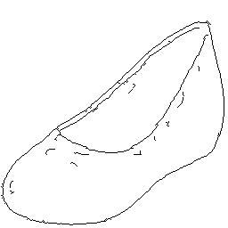
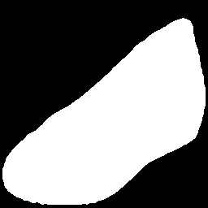
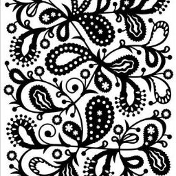
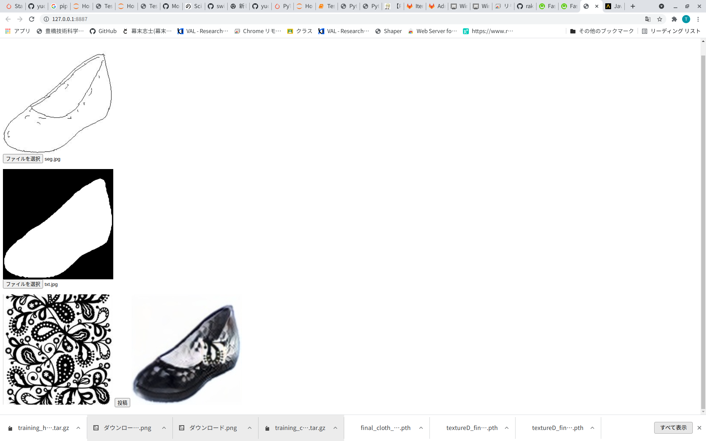

# TextureGAN

# Setup
## My environment

- linux OS
- cuda 11.2
- pytorch 1.9.0+cu111
- torchvision 0.10.0+cu111

# Installation

```
git clone https://galaxy.val.cs.tut.ac.jp/git/wakaiki/texturegan
pip install -r requirements.txt
```

# Usage

## API

We use fastAPI and uvicorn
```
uvicorn api:app
```
- http://127.0.0.1:8000/api/skechtoimg is sketch to img API.
The API need three image encoded base 64 by POST method. first image is sketch ,second is segment image ,last is texture.  
<br><br>
   
left:sketch , middle:segment image ,right:texture

- http://127.0.0.1:8000/api/debug is debug API.
The API need two image encoded base 64 by POST method. The API alpha blending for two image


## Frontend
You can open this folder as Web Server (I use [Web Server for Chrome](https://chrome.google.com/webstore/detail/web-server-for-chrome/ofhbbkphhbklhfoeikjpcbhemlocgigb?hl=ja))  
You canaccess to http://127.0.0.1:8887 , then　browser open like below site.  
  
<br>

You select three img (sketch , image , texture.). and click upload button , then you can get generate image by sketch and texture.  
(* You need to open API)

## Download Models
Pre-trained models 
- <a href='https://s3-us-west-2.amazonaws.com/texturegan/textureD_final_allloss_shoes_200.pth' >For shoe model</a>  
- <a href='https://s3-us-west-2.amazonaws.com/texturegan/textureD_final_allloss_handbag_3300.pth' > For handbag model </a>
- <a href=https://s3-us-west-2.amazonaws.com/texturegan/final_cloth_finetune.pth'> For clothe model </a>  
<br>

Download model ,and rewrite model_location in skgtoimg.py

# References
["TextureGAN: Controlling Deep Image Synthesis with Texture Patches"](https://texturegan.eye.gatech.edu/)

[Texture GAN by python3](https://github.com/yuchuanhui/TextureGanPython3)